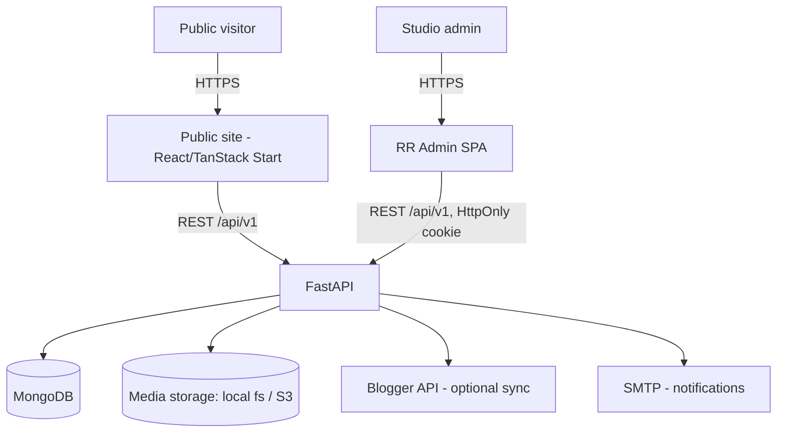

# Architecture

## Context diagram

## Components

- **Public site** — content-driven pages; reads only published documents via public
  read endpoints (no auth).
- **RR Admin SPA** — authenticated, cookie-based refresh session; calls the same
  `/api/v1` surface with elevated, RBAC-checked routes.
- **FastAPI** — single deployable, versioned API (`/api/v1`), Swagger at `/docs`.
- **MongoDB** — single database, collections per `schema.md`.
- **Media storage** — storage adapter interface; local filesystem in dev
  (`backend/uploads/<category>/`), S3-compatible in prod. Collections store a
  storage-relative key, never a hardcoded host.

## Request/data flow

1. Public page requests `GET /api/v1/services?state=published` — no auth header.
2. Admin edit calls `PATCH /api/v1/services/{id}` with access-token bearer header;
   RBAC dependency checks role before the handler runs.
3. Write handlers go through: Pydantic validation → service layer (business rules,
   slug collision, media reference update) → repository layer (Motor query) →
   audit-log write → response envelope.

## Caching strategy

- Public read endpoints: short-TTL (60s) in-process cache keyed by
  `(collection, query)`; invalidated on any write to that collection.
- No caching on admin/auth endpoints.

## Storage strategy

- Media documents store: `key`, `category`, `mimeType`, `size`, `width/height` or
  `duration`, `referenceCount`, `createdBy`.
- Reference counting: incremented when a document field is set to a media id,
  decremented on unset/replace/delete. Physical deletion only when count reaches 0.

## Auth flow

1. `POST /api/v1/auth/login` → verify Argon2id hash → issue short-lived access JWT
   (body) + rotating refresh token (secure, HttpOnly, SameSite=Lax cookie).
2. `POST /api/v1/auth/refresh` → validates cookie token against `refresh_tokens`
   collection, rotates (old token revoked, new issued), returns new access JWT.
3. CSRF: refresh/logout require a double-submit CSRF header for cookie-authenticated
   requests, since they're state-changing and cookie-driven.
4. Logout revokes the current refresh token server-side.

## Background sync

- FastAPI lifespan starts an async task loop; a Mongo-based lock document
  (`blogger_sync_runs` with a `running` flag + TTL) ensures only one instance runs
  sync at a time in a multi-instance deployment.

## Deployment topology

- Local dev: `docker-compose.yml` — `api` (FastAPI/Uvicorn), `mongo`, `web` (Vite dev
  server proxying `/api` to `api`).
- Production: containerized API behind HTTPS termination (reverse proxy /
  platform-managed TLS), MongoDB Atlas, S3-compatible object storage, static SPA
  build served via CDN.

## Backup / recovery

- Daily automated MongoDB snapshot (Atlas backup or `mongodump` cron in
  self-hosted case), 14-day retention minimum.
- Documented restore: spin up a scratch Mongo instance, `mongorestore`, verify
  index presence, point a staging API instance at it before promoting.
- Media storage: versioned bucket (if S3) or daily rsync snapshot (if fs-based) —
  chosen per deployment target, documented in the environment's runbook.
